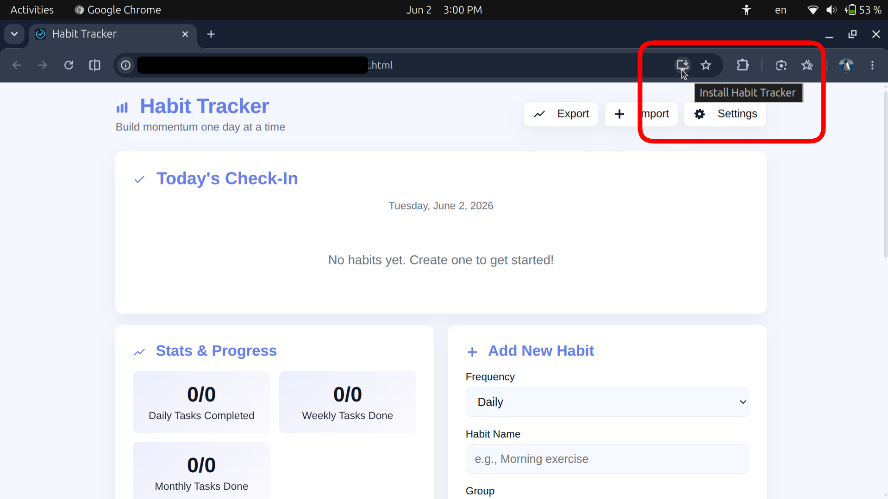
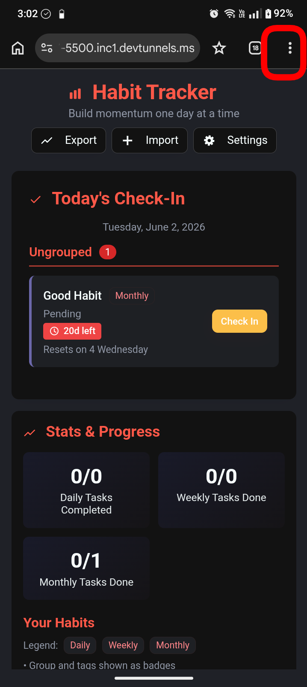

# User guide

Just follow the link and add the app to your device home screen as shown in the screenshots.

### Open the link

[This link will be updated soon!](#url)

### PC install

Just click the download button

### Mobile install

Follow the link and do as the screenshot suggests.

### Note:
To install a Progressive Web App (PWA), the `Add to Home Screen` equivalent varies by browser. Generally, you just need to look for a download icon (a monitor with a down arrow) in the address bar or a "Install" option inside the main browser men